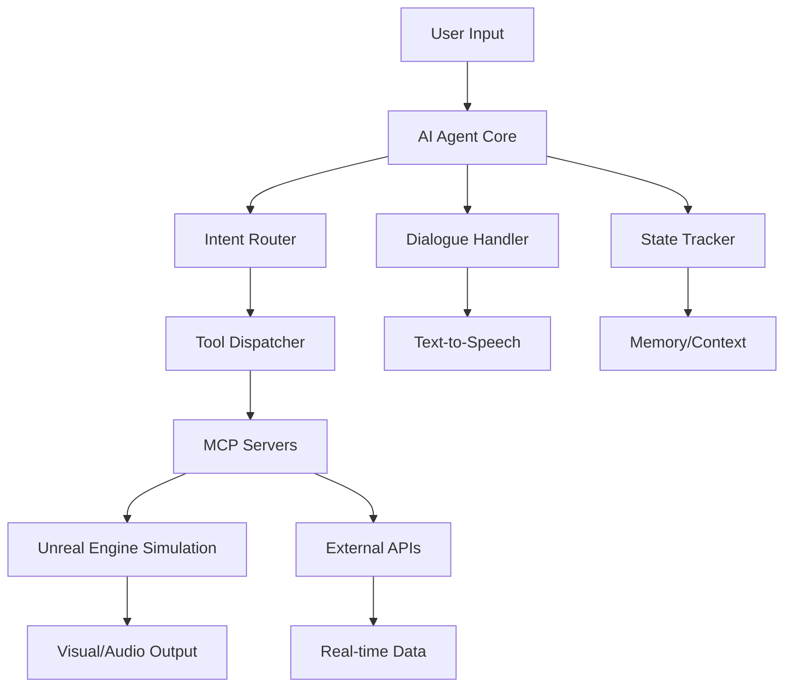

# Project Caesar — Unreal Engine + MCP + LLM

This project defines the simulation of an **AI-powered in-car assistant** operating in a **rural environment inspired by Yalova, Turkey**, using:

- **Unreal Engine** for 3D environment and events
- **LLM-based agent** for decision-making and dialogue
- **MCP (Model Context Protocol)** servers for tool exposure
- **Spotify, Weather, and GPS APIs** for realism

This documentation is intended for an autonomous AI agent that will generate the codebase using the structure and specifications below.

---

## 🎯 Primary Objective

Design and implement a **modular simulation system** that allows an AI agent to:
- Receive and interpret user input
- Communicate with multiple MCP tool servers
- Control simulation components and retrieve external data
- Engage in ongoing conversation with memory and context

---

## 🧠 Agent Logic Specification

The agent:
- Uses an **LLM with function/tool calling** support
- Selects tools from multiple MCP servers based on intent
- Maintains **context** across turns (e.g., music is playing, temperature is 23°C)
- Responds in natural language
- Calls simulation-control, UI, or sensor tools via REST endpoints

### Agent Modules

| Module             | Role |
|--------------------|------|
| `agent_core`       | Main loop, LLM interaction, memory |
| `intent_router`    | Classifies input → tool use |
| `tool_dispatcher`  | Maps intent → MCP tool → HTTP call |
| `dialogue_handler` | Handles conversations and TTS |
| `state_tracker`    | Stores current environment state |

---

## 🧩 MCP Server Design

Each MCP server exposes tools via a REST-like schema described in a YAML/JSON manifest.

### Server 1: `mcp-sim-actions`
> Tools for controlling simulated car components.

| Tool              | Input Params             | Effect                                |
|-------------------|--------------------------|----------------------------------------|
| `set_temperature` | `{ "temperature": float }` | Adjusts cabin temperature             |
| `set_music`       | `{ "track": string }`     | Plays Spotify music                   |
| `open_window`     | `{ "side": "left"|"right" }` | Opens the window on specified side  |
| `adjust_seat`     | `{ "position": string }`   | Changes seat position                 |

---

### Server 2: `mcp-sim-session`
> Lifecycle control of the simulation.

| Tool               | Input Params        | Description             |
|--------------------|---------------------|-------------------------|
| `start_simulation` | `none`              | Launches the simulation |
| `pause_simulation` | `none`              | Pauses simulation       |
| `reset_simulation` | `none`              | Resets simulation state |
| `log_event`        | `{ "type": string, "message": string }` | Logs contextual event |

---

### Server 3: `mcp-conversation`
> Handles AI-to-user dialogue tools.

| Tool           | Input Params                 | Description                        |
|----------------|------------------------------|------------------------------------|
| `talk`         | `{ "message": string }`       | Speak to user                      |
| `remember`     | `{ "key": string, "value": any }` | Store user preference            |
| `ask_confirm`  | `{ "prompt": string }`        | Ask yes/no confirmation            |
| `summarize`    | `none`                        | Summarize last actions or context  |

---

### Server 4: `mcp-external`
> Interfaces with external APIs and real-time data.

| Tool              | Input Params                    | Description                         |
|-------------------|----------------------------------|-------------------------------------|
| `get_weather`     | `{ "location": string }`         | Retrieves current weather           |
| `get_location`    | `none`                           | Returns simulated GPS coordinates   |
| `play_spotify`    | `{ "track": string }`            | Starts playback via Spotify         |
| `reroute`         | `{ "destination": string }`      | Provides new route                  |

---

## 🌍 Environment

**Simulation setting** is based on rural Yalova:
- Green hills, dirt roads, village houses
- Car driving through this terrain
- Events triggered by agent input (e.g., music starts when forest begins)

---

## 🧠 LLM Interaction Flow

```plaintext
[User Voice/Text Input]
    ↓
[Agent → LLM Reasoning]
    ↓
[Agent calls appropriate MCP tool]
    ↓
[MCP server executes]
    ↓
[Agent replies to user or triggers next step]
```

---

## 🚗 Project Structure

```
Project-Caesar/
├── README.md
├── agent/                     # AI Agent Core
│   ├── agent_core.py          # Main agent loop and LLM integration
│   ├── intent_router.py       # Intent classification logic
│   ├── tool_dispatcher.py     # MCP tool mapping and HTTP calls
│   ├── dialogue_handler.py    # Conversation and TTS management
│   ├── state_tracker.py       # Environment state storage
│   └── config/
│       ├── agent_config.yaml  # Agent configuration
│       └── prompts/           # System prompts and templates
├── mcp-servers/               # Model Context Protocol Servers
│   ├── mcp-sim-actions/       # Car component control server
│   ├── mcp-sim-session/       # Simulation lifecycle server
│   ├── mcp-conversation/      # Dialogue management server
│   └── mcp-external/          # External API integration server
├── unreal-project/            # Unreal Engine 5 Project
│   ├── Content/
│   │   ├── Maps/
│   │   │   └── YalovaRural.umap  # Main simulation map
│   │   ├── Blueprints/
│   │   │   ├── CarBP/         # Car blueprint and components
│   │   │   ├── EnvironmentBP/ # Environment interaction blueprints
│   │   │   └── UIBP/          # User interface blueprints
│   │   ├── Audio/             # Sound effects and music
│   │   ├── Materials/         # Textures and materials
│   │   └── Models/            # 3D assets
│   ├── Plugins/               # Custom plugins
│   │   └── MCPIntegration/    # Plugin for MCP communication
│   └── Source/                # C++ source code
│       └── ProjectCaesar/     # Main project module
├── api-integration/           # External API wrappers
│   ├── spotify_client.py      # Spotify Web API integration
│   ├── weather_client.py      # Weather API integration
│   └── gps_simulator.py       # GPS coordinate simulation
├── tests/                     # Test suites
│   ├── agent_tests/           # Agent module tests
│   ├── mcp_tests/             # MCP server tests
│   └── integration_tests/     # End-to-end tests
├── docs/                      # Additional documentation
│   ├── ARCHITECTURE.md        # System architecture details
│   ├── API_SPECS.md          # API specifications
│   └── DEPLOYMENT.md         # Deployment instructions
├── scripts/                   # Utility scripts
│   ├── setup.sh              # Environment setup script
│   ├── run_simulation.sh      # Simulation startup script
│   └── deploy.sh             # Deployment script
├── requirements.txt           # Python dependencies
├── docker-compose.yml        # Multi-service orchestration
└── .env.example              # Environment variables template
```

---

## 🔧 Technical Requirements

### Dependencies

**Python (Agent & MCP Servers)**
- Python 3.9+
- OpenAI/Anthropic SDK for LLM integration
- FastAPI for MCP server REST endpoints
- WebSocket support for real-time communication
- SQLite/PostgreSQL for state persistence

**Unreal Engine**
- Unreal Engine 5.3+
- C++ development tools
- Custom MCP integration plugin
- HTTP client for agent communication

**External APIs**
- Spotify Web API (music playback)
- OpenWeatherMap API (weather data)
- Google Maps API (optional for advanced routing)

### System Architecture



---

## 🚀 Getting Started

### Prerequisites

1. **Python 3.9+** with pip
2. **Unreal Engine 5.3+** installed
3. **API Keys** for:
   - OpenAI/Anthropic (for LLM)
   - Spotify Web API
   - OpenWeatherMap
4. **Git** for version control

### Quick Setup

1. **Clone the repository:**
   ```bash
   git clone https://github.com/your-org/Project-Caesar.git
   cd Project-Caesar
   ```

2. **Set up Python environment:**
   ```bash
   python3 -m venv venv
   source venv/bin/activate  # On Windows: venv\Scripts\activate
   pip install -r requirements.txt
   ```

3. **Configure environment variables:**
   ```bash
   cp .env.example .env
   # Edit .env with your API keys and configuration
   ```

4. **Start MCP servers:**
   ```bash
   ./scripts/setup.sh
   ```

5. **Launch simulation:**
   ```bash
   ./scripts/run_simulation.sh
   ```

---

## 🎮 Usage Examples

### Basic Conversation
```
User: "It's getting cold in here"
Agent: "I'll adjust the temperature for you. Setting cabin temperature to 22°C."
→ Calls mcp-sim-actions/set_temperature
```

### Music Control
```
User: "Play some relaxing music"
Agent: "I'll find some relaxing music for our drive through Yalova."
→ Calls mcp-external/play_spotify with genre preference
→ Calls mcp-sim-actions/set_music to update simulation
```

### Weather Integration
```
User: "What's the weather like?"
Agent: "Let me check the current conditions in Yalova..."
→ Calls mcp-external/get_weather
→ Returns real-time weather data
```

---

## 🧪 Testing

### Unit Tests
```bash
pytest tests/agent_tests/
pytest tests/mcp_tests/
```

### Integration Tests
```bash
pytest tests/integration_tests/
```

### Simulation Tests
```bash
# Launch test scenarios in Unreal Engine
./scripts/test_scenarios.sh
```

---

## 📈 Performance Metrics

The system tracks:
- **Response latency** (agent → tool → response)
- **LLM token usage** and costs
- **Tool success rates** across MCP servers
- **User satisfaction** via dialogue metrics
- **Simulation frame rate** and resource usage

---

## 🔮 Future Enhancements

- **Multi-language support** (Turkish, English)
- **Voice recognition** integration
- **Advanced route planning** with real-time traffic
- **Personalization** based on user behavior
- **VR/AR integration** for immersive experience
- **Cloud deployment** with scalable architecture

---

## 🤝 Contributing

1. Fork the repository
2. Create a feature branch (`git checkout -b feature/amazing-feature`)
3. Commit your changes (`git commit -m 'Add amazing feature'`)
4. Push to the branch (`git push origin feature/amazing-feature`)
5. Open a Pull Request

### Development Guidelines

- Follow PEP 8 for Python code
- Use Unreal Engine coding standards for C++
- Write comprehensive tests for new features
- Update documentation for API changes
- Ensure MCP server compatibility

---

## 📄 License

This project is licensed under the MIT License - see the [LICENSE](LICENSE) file for details.

---

## 📞 Support

For questions, issues, or contributions:

- **GitHub Issues**: [Project Issues](https://github.com/your-org/Project-Caesar/issues)
- **Documentation**: [Full Documentation](docs/)
- **Email**: project-caesar-support@your-org.com

---

**Built with ❤️ for the future of AI-powered automotive experiences**